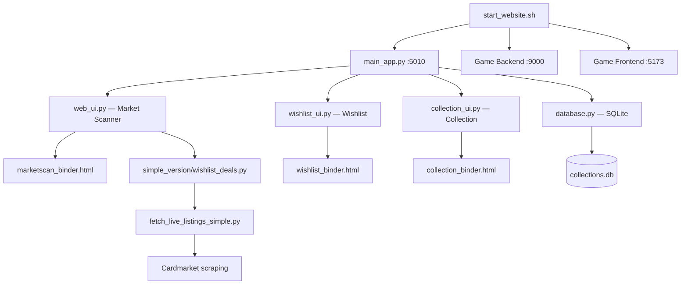

# 001 — Rough Project Structure

## Overview
* MTG (Magic: The Gathering) collection manager + market scanner
* Monolithic Python/FastAPI web app served on port 5010
* Part of a larger project at `/opt/magicgamestation/` (which also includes a game backend + frontend)

## Disk Footprint

| Path | Size | Notes |
|------|------|-------|
| `data/raw/` | 1.5 GB | Raw market data — bulk of total |
| `venv/` | 222 MB | Python virtualenv |
| `card_images_sets/` | 80 MB | Set-specific card images (Scryfall) |
| `card_images/` | 7 MB | Generic card images |
| `results/` | 2.1 MB | Market scan output JSONs |
| Everything else | ~2 MB | Code, templates, config, DB |
| **Total** | **1.8 GB** | |

## Python Files by Size (lines)

| File | Lines | Role |
|------|-------|------|
| [`collection_ui.py`](../../collection_ui.py) | 5,629 | Collection manager UI + API (largest file) |
| [`collection_ui_mitt.py`](../../collection_ui_mitt.py) | 5,105 | Alternate collection UI (mitt variant) |
| [`wishlist_ui.py`](../../wishlist_ui.py) | 2,406 | Wishlist manager UI + API |
| [`main_app.py`](../../main_app.py) | 1,633 | Unified entry point, mounts sub-apps |
| [`database.py`](../../database.py) | 1,145 | SQLite ORM / data access layer |
| [`fetch_live_listings_simple.py`](../../fetch_live_listings_simple.py) | 1,140 | Cardmarket scraper |
| [`web_ui.py`](../../web_ui.py) | 1,131 | Market scanner UI + API |
| [`check_missing_market_prices.py`](../../check_missing_market_prices.py) | 657 | Market price checker utility |
| [`determine_format_validity.py`](../../determine_format_validity.py) | 436 | Format legality checker |
| All others (15 files) | <400 each | Utilities, analysis, migration, auth |
| **Total** | **21,695** | |

## Architecture

## Key Directories

| Directory | Contents |
|-----------|----------|
| [`web_templates/`](../../web_templates/) | 3 Jinja2 HTML templates (83-103 KB each — large, contain inline JS/CSS) |
| [`simple_version/`](../../simple_version/) | Standalone market scanning scripts (`wishlist_deals.py`, `discovery.py`) |
| [`mtg_arbitrage/`](../../mtg_arbitrage/) | Arbitrage analysis module (config, data_loader, utils, wishlist) |
| [`tests/`](../../tests/) | 12 test files (API, auth, DB, collection, sorting, frontend) |
| [`data/`](../../data/) | Raw market data (1.5 GB) + processed results |
| [`card_images/`](../../card_images/) | Generic card images from Scryfall |
| [`card_images_sets/`](../../card_images_sets/) | Set-specific card images from Scryfall |
| [`results/`](../../results/) | Market scan output JSON files |

## Data Layer
* **SQLite**: `collections.db` (299 KB) — primary DB for collections
* **JSON files**: `collection.json`, `wishlist.json` + backup/archive variants
* **Card data**: images cached from Scryfall API, `sets_data.json` for set metadata
* **Market data**: `card_printings_cache.json`, scan results in `results/`

## Dependencies (from requirements.txt)
* **Web**: FastAPI, Uvicorn, Jinja2, python-multipart
* **HTTP**: requests, httpx, urllib3
* **Scraping**: BeautifulSoup4, lxml
* **Data**: pandas, numpy, python-dateutil
* **Config/Auth**: python-dotenv, itsdangerous

## Parent Project Context
* `/opt/magicgamestation/` contains:
  * `cards_binders/` — this project
  * `backend/` — game backend server
  * `frontend/` — game frontend (likely Vite/React on :5173)
  * `deploy/`, `docs/`, `logs/`
* Caddy reverse proxy is used for domain routing

## Effort Estimates for Familiarization

| Component | Engineer Skim | LLM Context Load |
|-----------|--------------|------------------|
| `main_app.py` (entry point) | Quick — routing + mount logic | ~1,600 lines |
| `web_ui.py` (market scanner) | Medium — Flask-style routes | ~1,100 lines |
| `wishlist_ui.py` | Medium-High — large UI module | ~2,400 lines |
| `collection_ui.py` | **High** — 5,600 lines, largest file | ~5,600 lines |
| `database.py` | Medium — SQLite schema + queries | ~1,100 lines |
| `fetch_live_listings_simple.py` | Medium — scraping logic | ~1,100 lines |
| HTML templates (3 files) | **High** — 83-103 KB each, inline JS | ~279 KB total |
| `simple_version/` | Medium — standalone scripts | ~1,700 lines |
| `mtg_arbitrage/` | Low-Medium — self-contained module | ~1,100 lines |
| `tests/` | Low — standard test structure | 12 files |
