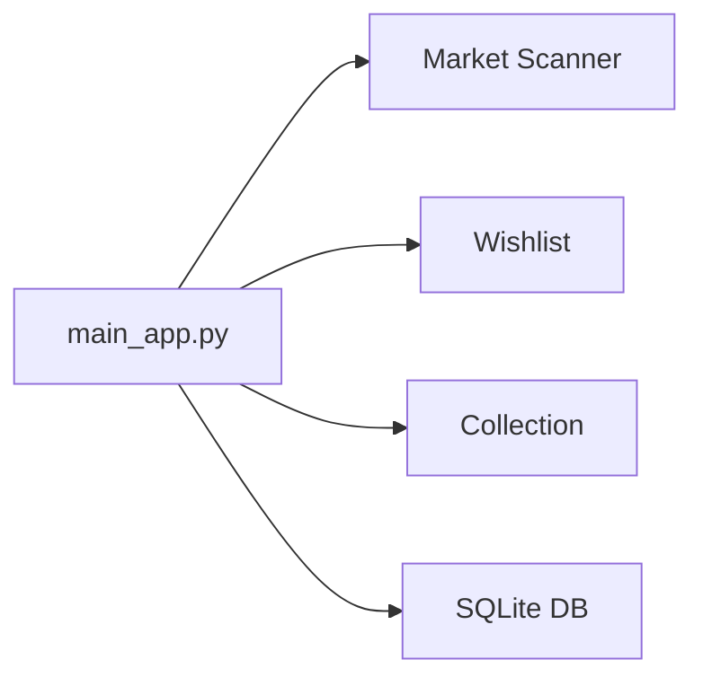

# 001 — Project Structure Summary

## What Is This
* MTG card collection manager + market scanner
* Python/FastAPI monolith on port 5010
* Part of larger `/opt/magicgamestation/` project (also has game backend/frontend)

## Architecture at a Glance

## Code Size
* **21,695 lines** of Python across 24 files
* 3 large HTML templates (~280 KB total, inline JS/CSS)
* Biggest files: `collection_ui.py` (5.6K lines), `collection_ui_mitt.py` (5.1K), `wishlist_ui.py` (2.4K)

## Where the Disk Space Goes
* 1.5 GB → `data/raw/` (market data)
* 222 MB → `venv/`
* 80 MB → `card_images_sets/`
* Code + config + DB → ~2 MB

## Key Takeaways for Contributors
* Entry point: `main_app.py` → mounts sub-apps as FastAPI routers
* `collection_ui.py` is the elephant — any refactoring effort starts there
* Data is split between SQLite (`collections.db`) and JSON files
* Card images fetched from Scryfall, cached locally
* Market data scraped from Cardmarket via `fetch_live_listings_simple.py`

→ Detailed breakdown: [extensive/001-rough-structure.md](../extensive/001-rough-structure.md)
